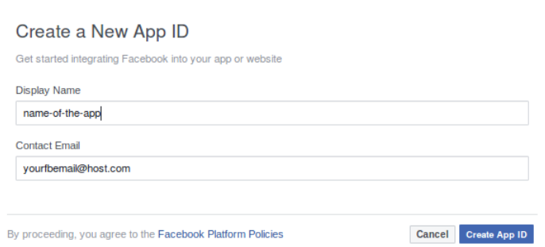
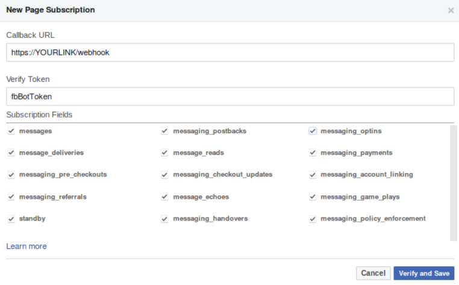

# SAO JOAO BOT

Bot for Facebook Messenger using the version 2.4 of the Facebook's API.

### How to set up the app on Facebook

1.  Go to the [Facebook Developers page](https://developers.facebook.com).
2.  Log in using an existent Facebook account.
3.  On the right corner pass the mouse over the user's profile picture, and select the option "Add a New App".



4.  Click the button "Create App ID".
5.  The page "Add a Product" will then show up. On it, click the button "Set Up" in the Messenger card.
6.  In the card named "Token Generation", choose a page or create one for being selected.
7.  After giving access to Facebook, a Page Access Token will appear. Copy this token to the place of all the **ACCESS_TOKEN_GOES_HERE** on [application.properties](src/main/resources/application.properties).
8.  In the card "Webhooks", click the button "Setup Webhooks".
At this point, the application must be already running in a production environment or locally.
In case of a localhost application, local tunnel or ngrok will be needed for making the port you are using public.
The section **How to make the local development machine external** explains how to do this.
9.  In the card "New Page Subscription" which popped up after clicking on "Setup Webhooks", the information must be filled out as depicted in the following image.



Where "fbBotToken" is specified on [application.properties](src/main/resources/application.properties).
10.  Click "Verify and Save". If everything goes alright go to the next step.
11.  A "Select a Page" will appear in the card "Webhooks". Choose the same page as the one you gave access to in order to subscribe it to the created app.
12.  Done! The bot app for Messenger is configured, and you may test it already (if you are an admin, developer or tester of the app). Go to **Roles** on the left side for changing and giving permissions.

### How to make the local development machine external

```Terminal
$ npm install -g localtunnel
$ lt --port PORT_HERE
```
Where PORT_HERE is the port specified on [application.properties](src/main/resources/application.properties).

### Persistent menu

It can be changed as follows:

1. Edit the token on access_token in the file [persistentMenu.sh](scripts/persistentMenu.sh). Each element within the key "call_to_actions" is a new button.
2. In order to run it:

```Terminal
$ cd scripts
$ sh persistentMenu.sh
```

If everything goes as planned the following object is printed in the console at the end:

```Terminal
{"result":"Successfully added structured menu CTAs"}
```

### Image aspect ratio in carousel

* 1:1.91 -> height:width

